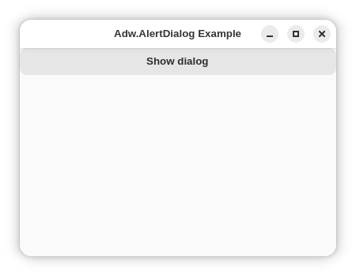
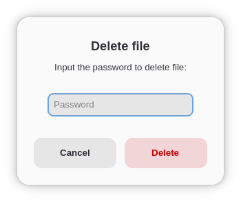

# Adwaita Dialog Example

This example shows how to create adwaita dialog, how to set default action, how to use additional field, how set field to hidden symbols (useful for password), how to get data from callback.

* Main window:

* Dialog:

